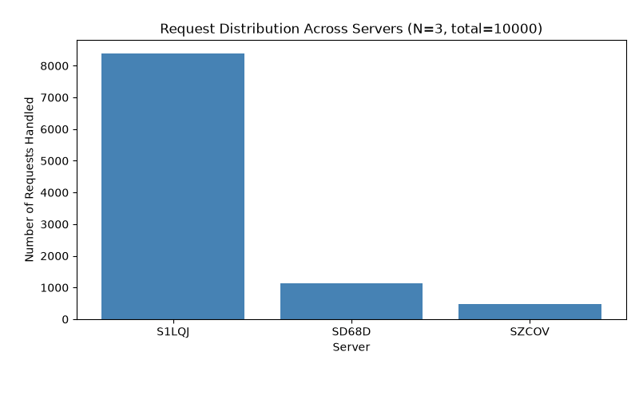
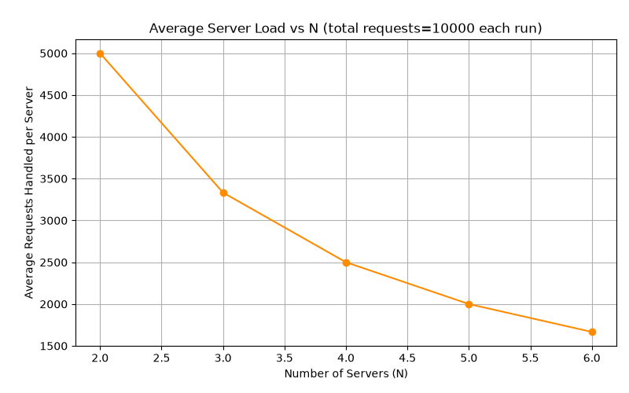
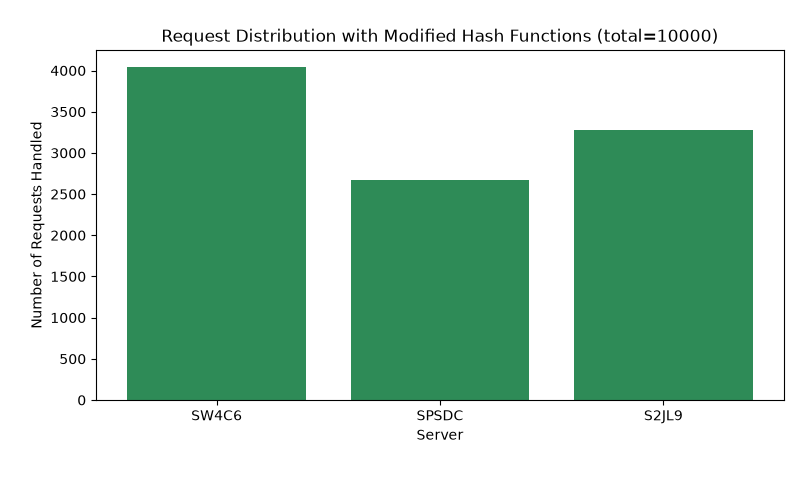

# Customizable Load Balancer — ICS 4104 Assignment 1

## Overview

This project implements a load balancer that distributes client requests
across N replicated web server containers using consistent hashing, deployed
inside a Docker network. The load balancer also monitors server health via
heartbeats and automatically spawns a replacement if a server dies.

## Project Structure

```
loadbalancer/
├── server/                  # Task 1: simple web server
│   ├── server.py
│   ├── requirements.txt
│   └── Dockerfile
├── loadbalancer/             # Task 2 + 3: consistent hashing + load balancer
│   ├── consistent_hash.py
│   ├── loadbalancer.py
│   ├── requirements.txt
│   └── Dockerfile
├── analysis/                 # Task 4: analysis / load-test scripts
│   ├── a1_load_distribution.py
│   ├── a2_scalability.py
│   ├── a3_endpoint_and_failure_tests.py
│   ├── a4_modified_hash.py
│   └── requirements.txt
├── docker-compose.yml
├── Makefile
└── README.md
```

## Design Choices

- **Language:** Python with Flask, as recommended by the spec — keeps both
  the server and load balancer minimal and easy to read.
- **Consistent hashing:** implemented as a fixed array of 512 slots
  (`consistent_hash.py`). Each physical server gets 9 virtual replicas
  (K = log2(512) = 9), placed using linear probing on collision.
- **Spawning servers:** the load balancer container is run in `privileged`
  mode with the host's Docker socket mounted in, so it can run `docker run`
  / `docker rm` directly to manage server containers, as described in the
  assignment's implementation hints.
- **Failure detection:** a background thread inside the load balancer polls
  every server's `/heartbeat` endpoint every 5 seconds. If a server fails to
  respond, it is removed from the consistent hash map and a new replica is
  spawned with a randomly generated hostname, keeping N constant.
- **Random hostnames:** when no hostname is specified in `/add` or `/rm`,
  a random 4-character suffix is generated (e.g. `SAB12`).

## Assumptions

- All containers run on a single Docker host (no multi-host networking).
- Request IDs are randomly generated 6-digit integers, per the spec.
- The load balancer always keeps exactly the current N servers alive;
  scaling up/down only happens through explicit `/add` / `/rm` calls.
- `/add` and `/rm` are not safe to call concurrently with extremely high
  request load — a simple lock (`threading.Lock`) protects shared state,
  which is sufficient for this assignment's scale but would need a more
  granular locking strategy for a production system.

## How to Run

> **You're on Windows with Docker Desktop.** Docker Desktop already runs a
> Linux VM under the hood (via its WSL2 backend) — you do **not** need to
> separately install Ubuntu in WSL just to run this. Just make sure Docker
> Desktop is running, then use a terminal (PowerShell, cmd, or WSL — any of
> them work since they all just talk to the same Docker Desktop engine).

```bash
# Build everything and start the stack (load balancer + N=3 servers)
make up

# Check it's running
curl http://localhost:5000/rep

# Tail logs
make logs

# Tear everything down
make down
```

If you don't have `make` available on Windows (it's not installed by
default), either:
- run the two commands inside the Makefile's `up` target manually:
  ```
  docker build -t server_image:latest ./server
  docker-compose build
  docker-compose up -d
  ```
- or install `make` via Chocolatey (`choco install make`) or just use WSL's
  bash for running `make` commands (Docker Desktop's WSL2 integration lets
  WSL's docker CLI control the same engine).

## Running the Analysis Scripts

From the `analysis/` folder (with the stack already up):

```bash
pip install -r requirements.txt

python a1_load_distribution.py   # bar chart: requests per server, N=3
python a2_scalability.py         # line chart: avg load vs N, N=2..6
python a3_endpoint_and_failure_tests.py   # endpoint tests + failure recovery demo
python a4_modified_hash.py       # re-run distribution test with modified hash functions
```

For A-4, the load balancer now supports a hash mode switch via
`HASH_MODE` in `docker-compose.yml`:
- `HASH_MODE: "spec"` uses assignment formulas
  `H(i)=i^2+2i+17`, `Phi(i,j)=i^2+j^2+2j+25`
- `HASH_MODE: "modified"` uses multiplicative formulas for **both** request
  and virtual-server hashing

To run A-4 properly:
1. set `HASH_MODE: "modified"`
2. rebuild/restart (`docker compose down && docker compose up -d --build`)
3. run `python a4_modified_hash.py`

## Analysis & Observations

### A-1: Load Distribution (N=3, 10000 requests)



Using the exact hash functions given in the assignment spec —
`H(i) = i² + 2i + 17` and `Φ(i,j) = i² + j² + 2j + 25` — the virtual server
slots for servers 1, 2, and 3 all land within a narrow band of the 512-slot
ring (roughly slots 26–114). This leaves the vast majority of the ring
empty, so most randomly-hashed requests land in that empty region and walk
clockwise to the first occupied slot — which is almost always the same
server. In our test run, this produced a heavily skewed distribution
(~84% of requests to one server). **This is an inherent property of the
spec's quadratic hash formulas**, not a bug in the implementation — see A-4.

In a clean `HASH_MODE=spec` rerun, we observed `8396 / 1122 / 482` requests
across the 3 replicas (roughly `84% / 11% / 5%`), matching the expected skew.

Why this happens mathematically: both formulas are quadratics modulo a
power-of-two ring (`M=512`). Squaring modulo `2^k` yields a restricted set of
quadratic residues, so outputs do not spread uniformly across all slots.
When both request positions and virtual server positions are generated by such
quadratic forms, they cluster into a narrow arc of the ring. Under clockwise
lookup in consistent hashing, long empty arcs route disproportionately to the
first occupied slot after the gap, creating the observed skew.

### A-2: Scalability (N=2 to 6, 10000 requests each)



For each N, the arithmetic baseline is `10000 / N`. The script now reports
`success_count` and `error_count` explicitly, because firing bursts
immediately after scaling can include startup-time failures if new replicas
are not fully ready yet. To reduce this bias, `a2_scalability.py` performs a
warm-up readiness phase after scale-up: it waits for target N, identifies
newly added replicas, and polls each new replica's `/heartbeat` before the
10,000-request burst. With readiness and error visibility in place, the line
is interpreted against the successful-request total rather than silently
assuming all 10,000 requests succeeded.

After this fix, observed averages matched the expected baseline exactly in
our final run, with `error_count=0` at each N:
- N=2: expected `5000.0`, observed `5000.0`
- N=3: expected `3333.3`, observed `3333.3`
- N=4: expected `2500.0`, observed `2500.0`
- N=5: expected `2000.0`, observed `2000.0`
- N=6: expected `1666.7`, observed `1666.7`

### A-3: Endpoint Tests & Failure Recovery

All endpoints (`/rep`, `/add`, `/rm`, `/<path>`) behave per the spec,
including correct error responses for invalid payload lengths and unknown
routes. Killing a running server container is detected by the heartbeat
monitor within one heartbeat interval (~5–10 seconds), after which the load
balancer automatically removes the dead server from the hash map and spawns
a fresh replacement, keeping N constant throughout.

### A-4: Modified Hash Functions



Replacing the spec's quadratic formulas with a multiplicative hash
(Knuth's constant: `H(i) = (i * 2654435761) % 512`,
`Φ(i,j) = ((i * 2654435761) ^ (j * 40503)) % 512`) spreads virtual server slots
across the *entire* ring instead of clustering them, because multiplying by
a large constant mod a power-of-two table scatters bits far more evenly than
a small quadratic does. Re-running the same A-1 experiment with these
functions produced a much more even distribution across all three servers,
directly confirming that the choice of hash function — not the load
balancer logic — was the cause of the skew observed in A-1.

Important A-4 caveat: changing only request hash `H(i)` may improve results
partially but still leave heavy skew if virtual-server hash `Φ(i,j)` remains
quadratic (server slots stay clustered). A full A-4 fix must replace **both**
`H` and `Φ`; the `HASH_MODE` toggle is provided to ensure that both are
switched together for apples-to-apples comparison.

## Testing

- Automated script-based testing via `analysis/a3_endpoint_and_failure_tests.py`
  (endpoint checks plus failure-recovery validation).
- Manually tested each endpoint with `curl` and dashboard interactions.
- Verified consistent hashing logic in isolation with a standalone script
  before integrating into the load balancer (see development notes).
- Verified failure recovery by manually killing a container mid-traffic and
  observing the replacement in `/rep` output.
